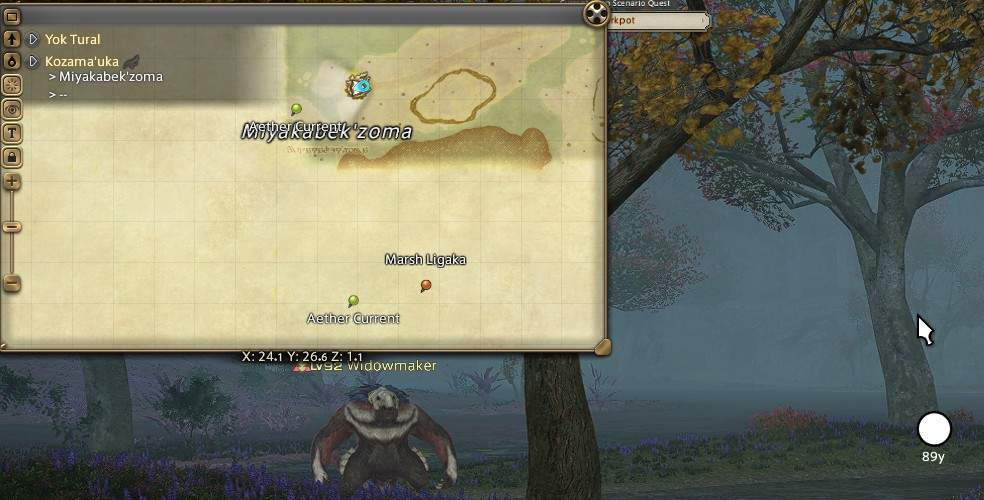

## Aether Radar

A simple overlay that shows nearby aether currents with distance, direction, off-screen indicators, and static map markers for all known aether current locations.

**Author:** Le Vagabond

## Features

- Detects aether currents in memory and displays them on screen
- Shows distance and cardinal direction to each current
- Off-screen indicators point towards currents not visible on screen
- Filters out already collected currents
- Moveable list window with lock option
- Color-coded by distance (green = close, yellow = medium, white = far)
- Map coordinates display
- Static map markers showing all known aether current locations for the current zone (coordinates from [Eorzea World](https://eorzeaworld.com/en/aethercurrents))
- Customizable map marker icon via built-in icon picker
- Works in all supported languages (EN/JP/DE/FR)

## Installation

1. Download `aetherradar.dll` and `aetherradar.json` from [Releases](https://github.com/Le-Vagabond-gh/ffxiv_aetherradar/releases) to the same folder
2. Open the Dalamud Plugin Installer in-game
3. Go to Settings
4. Head to the "Experimental" tab
5. Under "Dev Plugin Locations", click "Select dev plugin DLL"
6. Select the `aetherradar.dll` you downloaded
7. Press "Save and Close"
8. In the main plugin installer window, enable the plugin under Dev Tools

## Why Install From Releases Instead of a Custom Repository?

Adding custom plugin repositories to Dalamud is a security risk because repository maintainers can push updates at any time, and those updates are automatically installed. A compromised or malicious repository could push harmful code directly to your game client.

**Installing from GitHub Releases is safer because:**

- **Immutable releases enabled** - this repository has immutable releases turned on, meaning once published, the release files cannot be modified, replaced, or deleted
- **You control updates** - new versions only install when you manually download them
- **Full transparency** - you can inspect the exact code that built each release via the commit history and GitHub Actions logs
- **No automatic execution** - malicious updates can't be silently pushed to your client

This approach gives you the security of knowing exactly what code is running, while still benefiting from community-developed plugins.

## Usage

Once enabled, the plugin automatically detects nearby aether currents and displays:
- A list window showing distance and direction (moveable, can be locked)
- Screen markers on visible currents
- Arrow indicators pointing to off-screen currents

### Commands

- `/aetherradar` - Open the settings window

### Settings

- **Enable Overlay** - Toggle the entire overlay on/off
- **Show List Window** - Toggle the list of nearby currents
- **Show Screen Markers** - Toggle the dot markers on currents
- **Show Off-screen Indicators** - Toggle arrows pointing to off-screen currents
- **Lock List Position** - Lock the list window in place
- **Show Distance/Direction/Map Coordinates** - Toggle info display
- **Show Static Map Markers** - Show all known aether current locations on the map for the current zone
- **Icon Button** - Opens the icon picker to customize the map marker icon
- **Unlimited Distance** - Show all currents in memory regardless of distance
- **Show Collected Currents** - Debug option to also show already collected currents

## License

AGPL-3.0-or-later
