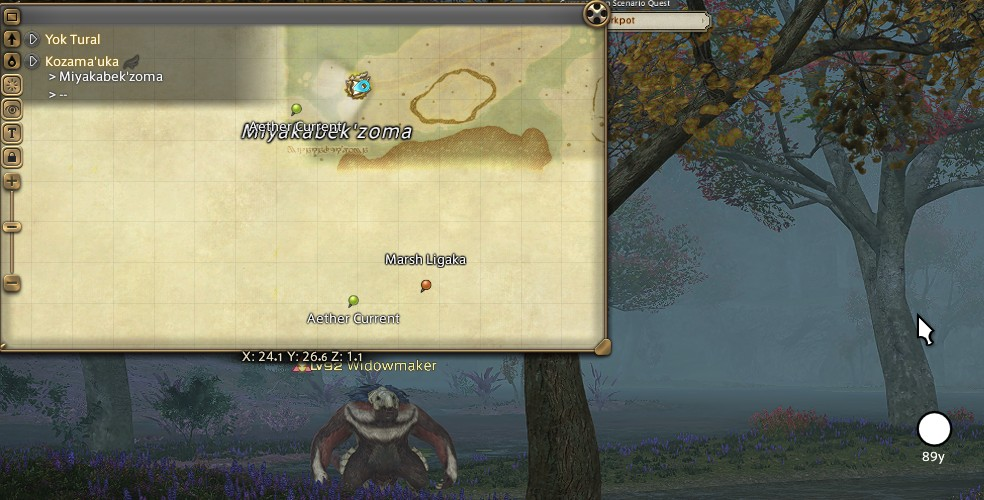

## Aether Radar

A simple overlay that shows nearby aether currents with distance, direction, off-screen indicators, and static map markers for all known aether current locations.



**Author:** Le Vagabond

## Features

- Detects aether currents in memory and displays them on screen
- Shows distance and cardinal direction to each current
- Off-screen indicators point towards currents not visible on screen
- Filters out already collected currents
- Moveable list window with lock option
- Color-coded by distance (green = close, yellow = medium, white = far)
- Map coordinates display
- Static map markers showing all known aether current locations for the current zone (coordinates from [Eorzea World](https://eorzeaworld.com/en/aethercurrents))
- Customizable map marker icon via built-in icon picker
- Works in all supported languages (EN/JP/DE/FR)

## Installation
- Open the Dalamud Plugin Installer
- Go to Settings
- Head to the "Experimental" tab
- Under "Custom Plugin Repositories", paste this URL and click the `+` button:

  ```
  https://raw.githubusercontent.com/Le-Vagabond-gh/FFXIV_Dalamud_Repo/main/repo.json
  ```

- Press "Save and Close"
- Install "Aether Radar" from the main plugin installer window

Updates then arrive through the plugin installer like for any other plugin.

If you would rather control updates yourself, download `aetherradar-<version>-full.zip` from [Releases](https://github.com/Le-Vagabond-gh/ffxiv_aetherradar/releases) (releases are immutable, so a published build can never be swapped), extract it and add the extracted `aetherradar.dll` as a dev plugin location under the same "Experimental" tab.

## Usage

Once enabled, the plugin automatically detects nearby aether currents and displays:
- A list window showing distance and direction (moveable, can be locked)
- Screen markers on visible currents
- Arrow indicators pointing to off-screen currents

### Commands

- `/aetherradar` - Open the settings window

### Settings

- **Enable Overlay** - Toggle the entire overlay on/off
- **Show List Window** - Toggle the list of nearby currents
- **Show Screen Markers** - Toggle the dot markers on currents
- **Show Off-screen Indicators** - Toggle arrows pointing to off-screen currents
- **Lock List Position** - Lock the list window in place
- **Show Distance/Direction/Map Coordinates** - Toggle info display
- **Show Static Map Markers** - Show all known aether current locations on the map for the current zone
- **Icon Button** - Opens the icon picker to customize the map marker icon
- **Unlimited Distance** - Show all currents in memory regardless of distance
- **Show Collected Currents** - Debug option to also show already collected currents

## License

AGPL-3.0-or-later
